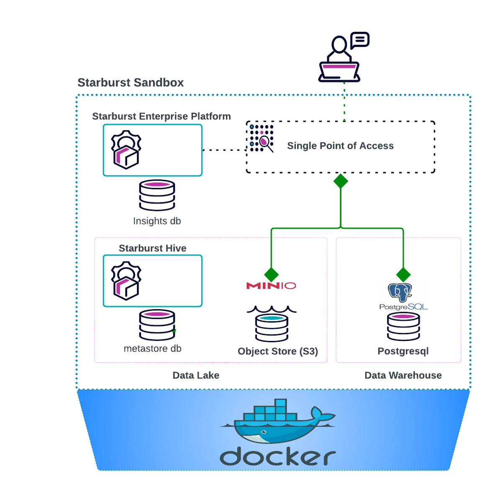

# starburst-sandbox
## About
The Starburst Sandbox is a community-driven initiative that aims to offer a rapid demonstration and development environment by leveraging docker-compose. Its primary objective is to showcase Data Products and BIAC functionalities to users. It is worth noting that this sandbox is not an officially supported project by Starburst Data and is not suitable for production purposes.

This Sandbox is based on the   https://github.com/starburstdata/dbt-trino   project and includes modification to enable Starburst Enterprise Features.

## Use Cases: 

- quick trials and functional testing
- development and demo purposes
- tutorials
- Sanbox Environment
- BIAC Demos
- Data Product Demos
- API testing

## Out of Scope:

- Performance testing
- Production workloads
- Support
- Authentication and encryption 
- Large data workloads

## Prerequisites
- docker compose
- Resources: 6GB RAM, 2 Cores, x GB Free Space
- Available Ports:  localhost:8080 and :9001
- Access to the Starburst Harbor Registry
- A valid Starburst Enterprise License request here https://www.starburst.io/contact

## Tested 

- Tested on Docker version 23.0.1 and Rancher Desktop Version 1.8.1 
- Tested with Starburst Enterprise Versions 
    - SEP STS 4.10

### Rancher Settings

#### Resource Settings

#### Rancher Container Settings

### Docker Settings

## Installation

## 1. Configure Starburst harbor registry

`docker login harbor.starburstdata.net/starburstdata --username <your-starburst-harbor-user --password <your-starburst-harbor-password>`

## 2. Test access to Starburst harbor registry

`docker search starburst-enterprise | grep starburstdata/starburst-enterprise `

You should receive the following output   
`starburstdata/starburst-enterprise    Docker image of Starburst Enterprise platform  4`

## 3. Clone the Github Repository

`git clone https://github.com/chrisstarburst/starburst-sandbox.git`

or using github cli

`gh repo clone chrisstarburst/starburst-sandbox`

## 4. Copy your requested Starburst license file (https://www.starburst.io/contact) to the starburst-sandbox folder in the ./docker/starburst/etc/ directory

`cp starburstdata.license ./docker/starburst/etc/starburstdata.license`

## 5. Start Starburst Sandbox

`./start-starburst.sh`

## 6.  Validate that you are able to access the endpoints

`Starburst UI -> http://localhost:8080`  
user: admin  
password: 

`Minio UI -> http://localhost:9001`  
user: minio  
password minio123  

## 7. Get familiar with with the Starburst UI

Starburst Login Page  

## Sandbox Maintenance

### Start Instances:
You can start the Starburst Sandbox using the following command: 

`./start-starburst.sh`

### Stop Instances:
You can stop the Starburst Sandbox using the following 
`./stop-starburst.sh`

### Clean Up Instances:
You can remove the instance including the data volumes 

`./remove-starburst.sh`

## Tutorial

Select the sysadmin role  

Create a sales domain

|     |  |  
| -------- | -------- | 
| Domain name  | **Sales**     | 
| Domain Description | **Sales Domain**    |  
| Schema location URI    | **s3://datalake/sales**    | 

Get famliar with the Query Editor and browse the connected data sources 

8. Use Starburst to write some data to the connected postgres and minio s3 data source.
Execute the following CTAS statements using the Starburst Insight Query Editor

Tip: You can use your mouse and  mark all the create table statements and then click the Run button. This will execute multiple CTAS statements in a sequential order. 

`-- Use Starburst Trino to write data to RDBMS like postgres and to a Datalake S3,ADLS,GCP,HDFS`   
`create table postgresql.public.customer as select * from tpch.tiny.customer;`  
`create table hive.default.orders as select *from tpch.tiny.orders;`  
`create table hive.default.lineitem as select * from tpch.tiny.lineitem;`   

## 9. Use Starburst to run a federated query accross different data sources including a datalake and rdbms. 
Execute the following query using the Starburst Insight Query Editor

`select  
    c.name,   
    c.nationkey,  
    sum(l.extendedprice) as spend,  
    avg(l.discount) as avgdiscount  
from  
    postgresql.public.customer as c
    inner join hive.default.orders as o using (custkey)
    inner join hive.default.lineitem as l using (orderkey)
where
    c.mktsegment = 'AUTOMOBILE'
    and c.nationkey in (6, 7, 19, 21, 22)
    and o.orderstatus = 'F'
    and o.orderdate >= date('1993-06-01')
group by
    c.name,
    c.mktsegment,
    c.nationkey,
    o.orderstatus,
    o.orderdate
order by
    spend desc;`

## 10. Create a Dataproduct

The goal of data products is to make data accessible, consumable, insightful, and actionable for the increasing number of stakeholders who rely on data to inform their decision-making.  

Data has immense value, but it’s hard to extract information that drives business objectives from raw data. Data products take raw data and translate it into something relevant and useful within its domain — a product people can utilize to achieve business goals.

In our next step we will create a data product that’s fit for consumption by downstream users.

Click on the "Add to Data Product" link and then select the Dialog "Create New data product" 

## 11. Define the Dataproduct

Provide a title and a description for your data product and click 'Save and Continue'.

## 12. Define the dataset for the data product

Now we will add our federated query as a dataset.  
Update the name of the dataset and add a description to your query. You can expand the show columns and add descriptions menu:

to add additional information to the columns on your data set and make it more meaningful for your data consumers.

## 14. Assing one or more data product owner

The people who build data products are also responsible for security, provenance, and ownership so that the final product better reflects the technical requirements of the data within the domain. 
Adding a data product owner is mandatory!

## 15. Add Tags to make the data product easily discoverable for your data consumers

Add some tags and Click Save and review. 

## 16. Publish the Data Product
As a last step we have to publish our data product before we can query and consume it. 

## 17. Copy the catalog information to consume the dataset 

Now we can copy the location "catalog.schema.table" of our dataset using the "Copy icon" under the automobile_customer_spend data set: 
In our example the location is: 

`hive.automobilespend.automobile_customer_spend`

## 18. Query the Data Product

You can go to the Query Editor and query the data product dataset using the following query: 

`select * from hive.automobilespend.automobile_customer_spend`

### 19. Searching for Data Products

## Security 

Starburst Enterprise platform (SEP) provides a built-in role-based access control (RBAC) system that is integrated with the Starburst Enterprise web UI. The RBAC system makes it easy to configure any user’s correct access rights to catalogs, individual schemas, and tables. If your security needs require more granular control, you can restrict or allow access to specific columns within a table, or to functions, stored procedures, session properties, or data products. The built-in access control audit log displays the log of access control changes made using the SEP built-in access control system.

In this Section we will use the built-in access control to restrict access to our data product by applying a row filter that let our data science role only access data with nationkey 7. We will also apply a column maks for the customer name to protect PII data. 

The masking and role level filters are applied on the fly without any requirements for data duplication on the source systems.  Starburst provides a governance layer on top of different connected data sources. The access to data as well as any changes are captured in an audit log.  

