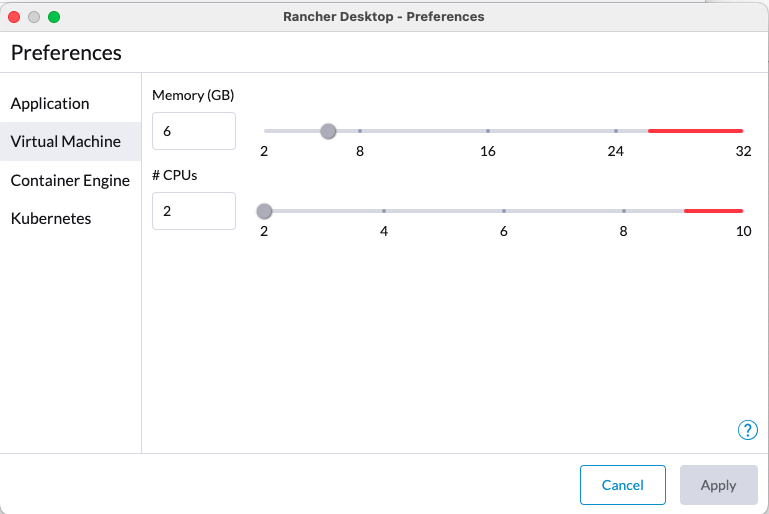

# starburst-sandbox
## About
The Starburst Sandbox is a community-driven initiative that aims to offer a rapid demonstration and development environment by leveraging docker-compose. Its primary objective is to showcase Data Products and BIAC functionalities to users. It is worth noting that this sandbox is not an officially supported project by Starburst Data and is not suitable for production purposes.
This Sandbox is based on the https://github.com/starburstdata/dbt-trino project and includes modification to enable Starburst Enterprise Features

## Prerequisites
- Docker or Rancher Desktop Version 1.8.1 
- 6GB RAM 2 Cores
- Access to the Starburst Harbor Registry
- A valid Starburst Enterprise License request here https://www.starburst.io/contact

### Rancher Settings

#### Resource Settings

#### Docker Settings

## Installation

1. Configure Starburst harbor registry

`docker login harbor.starburstdata.net/starburstdata --username <your-starburst-harbor-user --password <your-starburst-harbor-password>`

2. Test access to Starburst harbor registry

`docker search starburst-enterprise | grep starburstdata/starburst-enterprise `

3. Clone the Github Repository

`git clone https://github.com/chrisstarburst/starburst-sandbox.git`

4. Copy your requested Starburst license file (https://www.starburst.io/contact) to the starburst-sandbox folder in the ./docker/starburst/etc/ directory

`cp starburstdata.license ./docker/starburst/etc/starburstdata.license`

5. Start Starburst Sandbox

`./start-starburst.sh`

6.  Validate that you are able to access the endpoints

`Starburst UI -> http://localhost:8080`  
user: admin  
password: 

`Minio UI -> http://localhost:9001`  
user: minio  
password minio123  

7. Get familiar with with the Starburst UI

Starburst Login Page  

Select the sysadmin role  

Create a sales domain

|     |  |  
| -------- | -------- | 
| Domain name  | **Sales**     | 
| Domain Description | **Sales Domain**    |  
| Schema location URI    | **s3://datalake/sales**    | 

Get famliar with the Query Editor and browse the connected data sources 

8. Use Starburst to write some data to the connected postgres and minio s3 data source.
Execute the following CTAS statements using the Starburst Insight Query Editor

`-- Use Starburst Trino to write data to RDBMS like postgres and to a Datalake S3,ADLS,GCP,HDFS`   
`create table postgresql.public.customer as select * from tpch.tiny.customer;`  
`create table hive.default.orders as select *from tpch.tiny.orders;`  
`create table hive.default.lineitem as select * from tpch.tiny.lineitem;`   

9. Use Starburst to run a federated query accross different data sources
Execute the following query using the Starburst Insight Query Editor

`select  
    c.name,   
    c.nationkey,  
    sum(l.extendedprice) as spend,  
    avg(l.discount) as avgdiscount  
from  
    postgresql.public.customer as c
    inner join hive.default.orders as o using (custkey)
    inner join hive.default.lineitem as l using (orderkey)
where
    c.mktsegment = 'AUTOMOBILE'
    and c.nationkey in (6, 7, 19, 21, 22)
    and o.orderstatus = 'F'
    and o.orderdate >= date('1993-06-01')
group by
    c.name,
    c.mktsegment,
    c.nationkey,
    o.orderstatus,
    o.orderdate
order by
    spend desc;`
